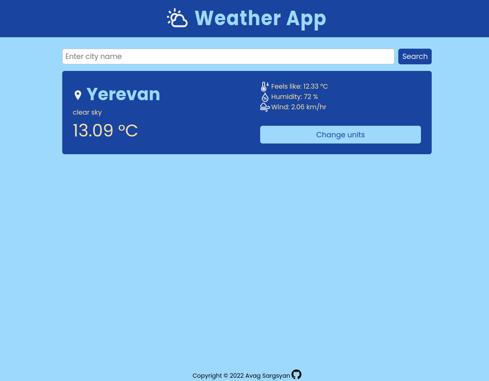

# Weather-app

A weather forecast app using the Open Weather Map API.

## Built with

- HTML
- SASS
- JavaScript
- Webpack
- [Open Weather Map](https://openweathermap.org/) API

## Getting Started

In order to setup and work on this project on your own, you will need to:

- Clone this project into your local environment
- Run `npm install` to install all the necessary packages
- Run `npm run dev` to start a live demo
- Run `npm run build` to produce distribution files

## Authors

This project is designed and created by [me](https://github.com/AvagSargsyan) during [The Odin Project](https://www.theodinproject.com/) Full stack developer curriculum.
All icons are from [iconmonstr](https://iconmonstr.com/).
